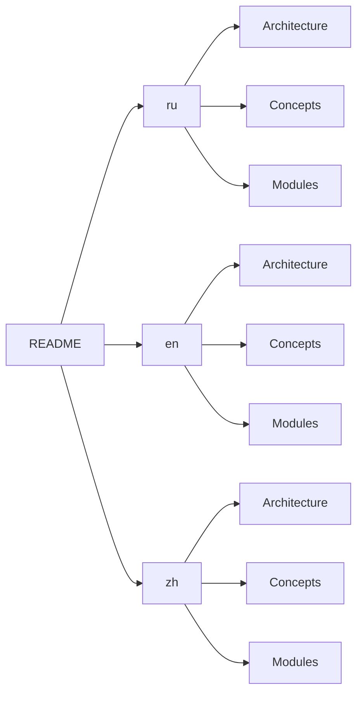

# :bricks: Go_Assist (Modulr)

> AI-driven modular automation platform · Go + React + Python

<div align="center">

[](LICENSE)
[](https://go.dev)
[](./docs)

</div>

---

## :globe_with_meridians: Select Language / Select Language / Select Language

| :ru: Russian | :us: English | :cn: Chinese |
|-------------|------------|---------|
| [Start](./docs/i18n/ru/README.md) | [Get Started](./docs/i18n/en/README.md) | [Start](./docs/i18n/zh/README.md) |

---

## :books: Documentation Hub



### Quick Links

| Section | :ru: | :us: | :cn: |
|---------|------|------|------|
| :bricks: Architecture | [Read](./docs/i18n/ru/architecture.md) | [Read](./docs/i18n/en/architecture.md) | [Read](./docs/i18n/zh/architecture.md) |
| :puzzle_pieces: Modules | [Read](./docs/i18n/ru/modules.md) | [Read](./docs/i18n/en/modules.md) | [Read](./docs/i18n/zh/modules.md) |
| :robot: AI Layer | [Read](./docs/i18n/ru/ai.md) | [Read](./docs/i18n/en/ai.md) | [Read](./docs/i18n/zh/ai.md) |
| :gear: Quick Start | [Read](./docs/i18n/ru/README.md) | [Read](./docs/i18n/en/README.md) | [Read](./docs/i18n/zh/README.md) |

---

## :rocket: Quick Start (EN)

```bash
git clone https://github.com/ezhigval/Go_Assist.git
cd Go_Assist
go mod tidy
cp config/config.example.yaml config/config.yaml
go run cmd/modulr/main.go
```

:information_source: **Full instructions**: :ru: | :us: | :cn:

---

## :handshake: Contributing

See [CONTRIBUTING.md](./CONTRIBUTING.md) for guidelines.

:bulb: **All documentation edits should be made ONLY in** `docs/i18n/{ru,en,zh}/`. **Root .md files editing is prohibited.`
