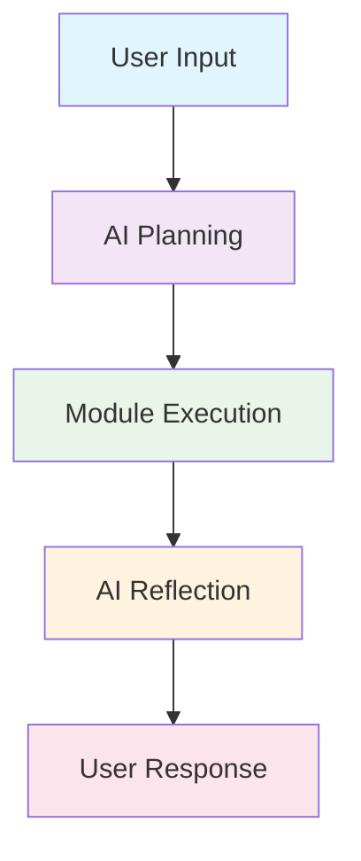

# Documentation Hub

## Language Selection / Select Language / Select Language

| :ru: Russian | :us: English | :cn: Chinese |
|-------------|------------|---------|
| [Start](./i18n/ru/README.md) | [Get Started](./i18n/en/README.md) | [Start](./i18n/zh/README.md) |

## Documentation Structure

### Core Documentation

| Section | :ru: | :us: | :cn: | Status |
|---------|------|------|------|--------|
| :bricks: Architecture | [Read](./i18n/ru/architecture.md) | [Read](./i18n/en/architecture.md) | [Read](./i18n/zh/architecture.md) | :white_check_mark: Complete |
| :puzzle_pieces: Concepts | [Read](./i18n/ru/concepts.md) | [Read](./i18n/en/concepts.md) | [Read](./i18n/zh/concepts.md) | :white_check_mark: Complete |
| :gear: Modules | [Read](./i18n/ru/modules.md) | [Read](./i18n/en/modules.md) | [Read](./i18n/zh/modules.md) | :construction: In Progress |
| :robot: AI Layer | [Read](./i18n/ru/ai.md) | [Read](./i18n/en/ai.md) | [Read](./i18n/zh/ai.md) | :construction: In Progress |

## Repository Structure

```
Go_Assist/
|
+-- cmd/           # Entry points (modulr, telegram-bot)
|
+-- core/          # Core: EventBus, Orchestrator, AI Engine
|
+-- docs/          # Documentation (multilingual)
|   |
|   +-- i18n/
|   |   |
|   |   +-- ru/    # Russian (primary)
|   |   +-- en/    # English
|   |   +-- zh/    # Chinese
|   |
|   +-- shared/    # Images, diagrams
|   +-- nav/       # Navigation
|
+-- modules/       # Domain modules (finance, calendar...)
|
+-- config/        # Configurations
|
+-- scripts/       # Utilities and validation
```

**Important**: All documentation is in `docs/i18n/`. Root files are for code and configs only.

## Quick Start

```bash
git clone https://github.com/ezhigval/Go_Assist.git
cd Go_Assist
go mod tidy
cp config/config.example.yaml config/config.yaml
go run cmd/modulr/main.go
```

:information_source: **Full instructions**: :ru: | :us: | :cn:

## Contributing

See [CONTRIBUTING.md](../CONTRIBUTING.md).

:bulb: **All documentation edits should be made ONLY in** `docs/i18n/{ru,en,zh}/`. **Root .md files editing is prohibited.**

---

## Architecture Overview



Go Assist follows a **strict separation of concerns**:
- **AI** makes decisions about what to do
- **Core** orchestrates the execution
- **Modules** perform the actual work

---

## Key Concepts

### Action
**Action** represents a single, atomic operation that the system should execute:

```go
type Action struct {
    Module string                 `json:"module"`    // Target module name
    Type   string                 `json:"type"`      // Action type within module
    Params map[string]interface{} `json:"params"`    // Action parameters
    ID     string                 `json:"id"`        // Unique action identifier
    Dependencies []string         `json:"dependencies"` // Action dependencies
}
```

### Result
**Result** represents the outcome of executing an Action:

```go
type Result struct {
    ActionID string                 `json:"action_id"` // Corresponding action ID
    Success  bool                   `json:"success"`    // Execution success status
    Data     interface{}            `json:"data"`       // Result data (if successful)
    Error    string                 `json:"error"`      // Error message (if failed)
    Metadata map[string]interface{} `json:"metadata"`   // Additional metadata
    Duration time.Duration         `json:"duration"`   // Execution time
}
```

### Execution Loop
The **Execution Loop** transforms user input into automated actions and responses through a 7-phase process.

---

## Quick Examples

### Basic Module Implementation

```go
// RU: Example module implementation
// EN: Example module implementation
// ZH: Example module implementation
type FinanceModule struct {
    db Database
    cache Cache
}

func (f *FinanceModule) Execute(ctx context.Context, action Action) (Result, error) {
    switch action.Type {
    case "create_transaction":
        return f.createTransaction(ctx, action.Params)
    case "get_balance":
        return f.getBalance(ctx, action.Params)
    default:
        return Result{}, fmt.Errorf("unsupported action: %s", action.Type)
    }
}
```

### Usage Example

```bash
# RU: Test AI orchestration
# EN: Test AI orchestration
# ZH: Test AI orchestration
curl -X POST http://localhost:8080/api/v1/execute \
  -H "Content-Type: application/json" \
  -d '{"input": "What modules are available?"}'
```

---

## Contributing to Documentation

We welcome contributions to our documentation! Please follow these guidelines:

### Documentation Standards

1. **Use the TEMPLATE.md** as a reference for all new documentation
2. **Follow the glossary** for consistent terminology
3. **Include examples** in all three languages
4. **Test your changes** with the validation scripts

### Making Changes

1. Fork the repository
2. Create a feature branch
3. Make your documentation changes
4. Run validation: `./docs/scripts/validate-docs.sh`
5. Submit a pull request

### Style Guidelines

- Use **bold** for first mention of technical terms
- Use `code` format for subsequent mentions
- Include language-specific comments in code examples
- Add Mermaid diagrams for complex concepts

---

## Development Tools

### Validation Scripts

Run these scripts before committing:

```bash
# RU: Validate all documentation
# EN: Validate all documentation
# ZH: Validate all documentation
./docs/scripts/validate-docs.sh
```

The script checks:
- Link validity
- Spelling in all languages
- Mermaid diagram syntax
- i18n synchronization
- Required file presence

### Local Development

For local documentation development:

```bash
# RU: Install dependencies
# EN: Install dependencies
# ZH: Install dependencies
npm install

# RU: Start local server
# EN: Start local server
# ZH: Start local server
npm run start
```

---

## Help and Support

If you need help with the documentation:

- **Issues**: Report documentation problems on GitHub
- **Discussions**: Ask questions in GitHub Discussions
- **Contributing**: See our [Contributing Guide](../CONTRIBUTING.md)

---

*Last updated: 2026-04-10*  
*Version: v0.2*  
*Languages: English, Russian, Chinese*
