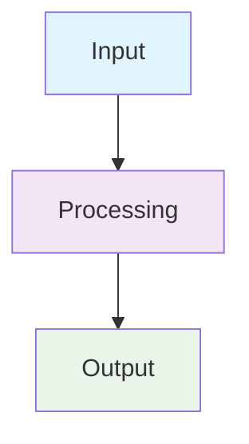

[<- Back to Table of Contents](../README.md) | 
[English](./en/page.md) | 
[English](./zh/page.md)

> :information_source: **You are here:** Home -> Section -> Subsection

---

# Section Title | Section Title | Section Title

## Overview

Brief description of what this section covers in all three languages.

### Key Concepts

- **Term1** - Definition in Russian / Definition in English / Definition in Chinese
- **Term2** - Definition in Russian / Definition in English / Definition in Chinese

---

## Main Content

### Subsection 1

Detailed content with proper formatting.

:::tip[Best Practice]
Use `context.WithTimeout()` for all external calls.

```go
// RU: Installation timeout
// EN: Setting timeout  
// ZH: Set timeout
ctx, cancel := context.WithTimeout(parentCtx, 5*time.Second)
defer cancel()
```

:::

### Code Examples

```go
// RU: Example of module implementation
// EN: Module implementation example
// ZH: Module implementation example
type Module interface {
    Execute(ctx context.Context, action Action) (Result, error)
}
```

### Diagrams



---

## API Reference

### Method: `Execute`

Executes the specified action.

```go
func (m *Module) Execute(ctx context.Context, action Action) (Result, error)
```

**Parameters:**
- `ctx` - Context for request timeout and cancellation
- `action` - Action to execute

**Returns:**
- `Result` - Execution result
- `error` - Error if execution failed

**Example:**

```go
// RU: Example usage
// EN: Usage example
// ZH: Usage example
result, err := module.Execute(ctx, Action{
    Module: "finance",
    Type:   "create_transaction",
    Params: map[string]interface{}{
        "amount": 100.0,
    },
})
```

---

## Configuration

### Environment Variables

| Variable | Description | Default | Required |
|----------|-------------|---------|----------|
| `AI_PROVIDER` | AI service provider | `openai` | Yes |
| `AI_API_KEY` | API key for AI service | - | Yes |
| `DB_DSN` | Database connection string | - | Yes |

### Configuration File

```yaml
# RU: Configuration example
# EN: Configuration example
# ZH: Configuration example
server:
  port: 8080
  timeout: 30s

ai:
  provider: openai
  model: gpt-4
  max_tokens: 2000
```

---

## Troubleshooting

### Common Issues

:::warning[Timeout Error]
If you receive timeout errors, increase the timeout value in your configuration.

```yaml
# RU: Increase timeout
# EN: Increase timeout
# ZH: Increase timeout
server:
  timeout: 60s
```

:::

### Error Codes

| Code | Description | Solution |
|------|-------------|----------|
| `E001` | Invalid action type | Check action type spelling |
| `E002` | Module not found | Verify module registration |
| `E003` | Permission denied | Check user permissions |

---

## Best Practices

### Performance

- Use connection pooling for database connections
- Implement proper error handling
- Cache frequently accessed data

### Security

- Validate all input parameters
- Use HTTPS for external communications
- Implement proper authentication

### Maintenance

- Write comprehensive tests
- Document all public APIs
- Follow semantic versioning

---

## FAQ

**Q:** How do I add a new module?  
**A:** Implement the `Module` interface and register it in the module registry.

**Q:** What's the difference between `Plan` and `Reflect` phases?  
**A:** `Plan` generates actions, `Reflect` interprets results.

---

## Related Documentation

- [Concepts](../concepts/README.md) - Core concepts and terminology
- [Modules](../modules/README.md) - Module development guide
- [AI Layer](../ai/README.md) - AI behavior and integration

---

## Contributing

To contribute to this documentation:

1. Fork the repository
2. Create a feature branch
3. Make your changes
4. Run validation scripts
5. Submit a pull request

---

## Language Navigation

[<- Back to Table of Contents](../README.md) | 
[English](./en/page.md) | 
[English](./zh/page.md)

---

*Last updated: 2026-04-10*  
*Version: v0.2*
