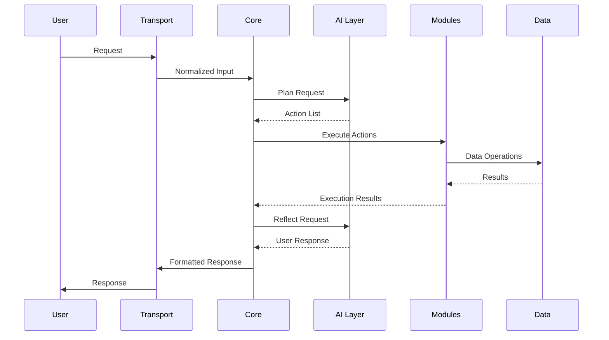

[<- Back to Documentation](../../README.md) | 
[English](../en/architecture/README.md) | 
[English](../zh/architecture/README.md)

> :information_source: **You are here:** Documentation -> Architecture -> Overview

---

# Architecture | Architecture | Architecture

## Overview

The Go Assist platform follows a **layered architecture** with strict separation between AI planning, core orchestration, and module execution. This design ensures:

- **Clear boundaries** between system responsibilities
- **Loose coupling** through event-driven communication
- **Scalable execution** through isolated modules
- **Maintainable codebase** with well-defined contracts

### Architectural Layers

```
Input Layer
    |
Transport Layer (HTTP, Telegram, Jobs)
    |
CORE Layer (Orchestrator)
    |       \
    |        \
AI Layer     EventBus
    |           |
    |      Modules Layer
    |           |
    |      Data Layer
    |
Output Layer
```

**Layer Responsibilities:**
- **Input Layer**: Receives external requests and events
- **Transport Layer**: Protocol-specific request handling
- **CORE Layer**: Event lifecycle management and coordination
- **AI Layer**: Planning and reflection capabilities
- **EventBus**: Decoupled communication infrastructure
- **Modules Layer**: Isolated execution units
- **Data Layer**: Persistent storage and caching
- **Output Layer**: Response formatting and delivery

---

## Core Layer

### Responsibility

The Core layer is the **central orchestrator** that manages the execution pipeline without making business decisions. Its key responsibilities:

- **Event Lifecycle Management**: Coordinates request processing from input to response
- **AI Coordination**: Manages communication with AI layer for planning and reflection
- **Module Execution**: Coordinates module execution based on AI decisions
- **Error Handling**: Manages failures and recovery strategies
- **State Management**: Maintains execution context across steps

### Event Loop

The Core operates on an event-driven loop:

```go
// RU: Main orchestration loop
// EN: Main orchestration loop
// ZH: Main orchestration loop
func (o *Orchestrator) ProcessEvent(ctx context.Context, input Input) error {
    // 1. Validate input
    if err := o.validateInput(input); err != nil {
        return err
    }
    
    // 2. Send to AI for planning
    actions, err := o.ai.Plan(ctx, input)
    if err != nil {
        return err
    }
    
    // 3. Execute actions through modules
    results, err := o.executeActions(ctx, actions)
    if err != nil {
        return err
    }
    
    // 4. Send results to AI for reflection
    response, err := o.ai.Reflect(ctx, input, results)
    if err != nil {
        return err
    }
    
    // 5. Deliver response
    return o.deliverResponse(ctx, response)
}
```

### Orchestration Strategy

The Core follows a **non-blocking orchestration** pattern:

- **Async Execution**: Actions can execute in parallel when possible
- **Context Propagation**: Request context flows through all layers
- **Timeout Management**: Each step has configurable timeouts
- **Circuit Breaking**: Failed modules don't block the entire pipeline

---

## AI Layer

### Plan / Reflect Separation

The AI layer is split into two distinct phases:

#### Planning Phase
- **Input**: User request + execution context
- **Output**: Structured list of actions to execute
- **Focus**: What needs to be done and how

```go
// RU: Planning request structure
// EN: Planning request structure
// ZH: Planning request structure
type PlanRequest struct {
    Input   string
    Context ExecutionContext
    History []ExecutionResult
}

type PlanResponse struct {
    Actions []Action
    Confidence float64
    Reasoning string
}
```

#### Reflection Phase
- **Input**: Original request + execution results
- **Output**: Final response to user
- **Focus**: Interpreting results and communicating outcome

```go
// RU: Reflection request structure
// EN: Reflection request structure
// ZH: Reflection request structure
type ReflectRequest struct {
    Input   string
    Results []ExecutionResult
    Actions []Action
}

type ReflectResponse struct {
    Response string
    Summary  string
    Success  bool
}
```

### Why Separated?

1. **Clear Responsibilities**: Planning focuses on execution strategy, reflection on communication
2. **Error Isolation**: Planning errors don't affect reflection and vice versa
3. **Caching Opportunities**: Plans can be cached for similar requests
4. **Testing**: Each phase can be tested independently
5. **Model Specialization**: Different AI models can specialize in planning vs. reflection

### Response Format

The AI layer returns structured responses:

```go
// RU: AI response structure
// EN: AI response structure
// ZH: AI response structure
type AIResponse struct {
    Phase      string    `json:"phase"`       // "plan" or "reflect"
    Actions    []Action  `json:"actions"`
    Response   string    `json:"response"`
    Confidence float64   `json:"confidence"`
    Reasoning  string    `json:"reasoning"`
    Metadata   map[string]interface{} `json:"metadata"`
}
```

---

## Modules Layer

### Contract

All modules implement the same interface:

```go
// RU: Module interface definition
// EN: Module interface definition
// ZH: Module interface definition
type Module interface {
    // Execute performs the specified action
    Execute(ctx context.Context, action Action) (Result, error)
    
    // Name returns the module identifier
    Name() string
    
    // Capabilities returns supported action types
    Capabilities() []string
    
    // Validate checks if action is supported
    Validate(action Action) error
}
```

### Module Examples

#### Finance Module
```go
// RU: Finance module implementation
// EN: Finance module implementation
// ZH: Finance module implementation
type FinanceModule struct {
    db Database
    cache Cache
}

func (f *FinanceModule) Execute(ctx context.Context, action Action) (Result, error) {
    switch action.Type {
    case "create_transaction":
        return f.createTransaction(ctx, action.Params)
    case "get_balance":
        return f.getBalance(ctx, action.Params)
    case "generate_report":
        return f.generateReport(ctx, action.Params)
    default:
        return Result{}, fmt.Errorf("unsupported action: %s", action.Type)
    }
}
```

#### Calendar Module
```go
// RU: Calendar module implementation
// EN: Calendar module implementation
// ZH: Calendar module implementation
type CalendarModule struct {
    calendar CalendarService
    notifier Notifier
}

func (c *CalendarModule) Execute(ctx context.Context, action Action) (Result, error) {
    switch action.Type {
    case "create_event":
        return c.createEvent(ctx, action.Params)
    case "schedule_meeting":
        return c.scheduleMeeting(ctx, action.Params)
    case "check_availability":
        return c.checkAvailability(ctx, action.Params)
    default:
        return Result{}, fmt.Errorf("unsupported action: %s", action.Type)
    }
}
```

### Module Isolation

Modules are **completely isolated**:
- No direct imports between modules
- Communication only through EventBus
- Independent configuration and lifecycle
- Separate error handling and logging

---

## Data Flow

### Detailed Pipeline

1. **Input Reception**  
   User input received via HTTP, Telegram, or scheduled jobs

2. **AI Planning**  
   Core sends input to AI for analysis and action planning

3. **Action Generation**  
   AI returns structured list of actions to execute

4. **Module Execution**  
   Core coordinates module execution based on action list

5. **Result Collection**  
   Modules return execution results to Core

6. **AI Reflection**  
   Core sends results to AI for final response generation

7. **Response Delivery**  
   AI-formatted response returned to user

### Data Flow Explanation

#### Step-by-Step with Context

**Step 1: Input Processing**
- User sends request through any transport
- Transport layer validates and normalizes input
- Core orchestrator receives structured Input object

**Step 2: AI Planning**
- Core sends Input to AI layer with execution context
- AI analyzes request and generates Action list
- Actions validated against module registry
- Core receives structured PlanResponse

**Step 3: Module Execution**
- Core publishes actions to EventBus
- Modules subscribe to relevant action types
- Actions execute in parallel where dependencies allow
- Results collected and aggregated

**Step 4: AI Reflection**
- Core sends original Input + Results to AI
- AI interprets results and generates user response
- Response formatted for appropriate transport

**Step 5: Response Delivery**
- Core delivers response through original transport
- Execution metrics logged and stored
- Feedback loop updates AI model weights

### Error Handling Flow

```
Module Execution Error
       |
Core Orchestrator
       |
Error Classification
       |
Retry? --- Yes ---> Retry with Backoff
       |
No
       |
Fallback Strategy
       |
AI Reflection (with error context)
       |
User Notification
```

---

## Sequence Diagram



---

## Key Architectural Decisions

### 1. Strict Separation of Concerns
- **AI**: Only plans and reflects, never executes
- **Core**: Only orchestrates, never makes decisions
- **Modules**: Only execute, never plan or reflect

### 2. Event-Driven Communication
- Loose coupling between components
- Easy to add new transports and modules
- Natural fit for async processing

### 3. Standardized Contracts
- Action/Result interfaces are universal
- Module interface is simple and consistent
- AI responses follow predictable structure

### 4. Context Propagation
- Request context flows through all layers
- Enables proper cancellation and timeouts
- Supports distributed tracing

### 5. Error Isolation
- Module failures don't crash the system
- AI errors have fallback strategies
- Each layer handles its own error cases

---

## Scalability Considerations

### Horizontal Scaling
- **Stateless Core**: Multiple orchestrator instances
- **Module Clusters**: Multiple instances per module type
- **EventBus Scaling**: Message brokers for high throughput

### Vertical Scaling
- **Resource Allocation**: CPU/memory per module type
- **Database Optimization**: Connection pooling and caching
- **AI Model Scaling**: GPU resources for AI layer

### Performance Optimization
- **Action Batching**: Group similar actions
- **Result Caching**: Cache frequent query results
- **AI Model Caching**: Cache AI responses for similar inputs

---

## Security Architecture

### Input Validation
- All inputs validated at transport layer
- AI responses validated before execution
- Module parameters type-checked

### Access Control
- Module-level permissions
- Action-type authorization
- Data access controls based on user context

### Audit Trail
- All actions logged with full context
- AI decisions recorded
- Module execution tracked

---

## Monitoring and Observability

### Metrics Collection
- Request latency and throughput
- Module execution times
- AI response confidence scores
- Error rates by component

### Logging Strategy
- Structured logging with correlation IDs
- Log levels per component
- Sensitive data redaction

### Distributed Tracing
- Request tracing across layers
- Module execution traces
- AI decision tracking

---

## Related Documentation

- [Concepts](../concepts/README.md) - Core concepts and terminology
- [Modules](../modules/README.md) - Module development guide
- [AI Layer](../ai/README.md) - AI behavior and integration

---

## Language Navigation

[<- Back to Documentation](../../README.md) | 
[English](../en/architecture/README.md) | 
[English](../zh/architecture/README.md)

---

*Last updated: 2026-04-10*  
*Version: v0.2*
